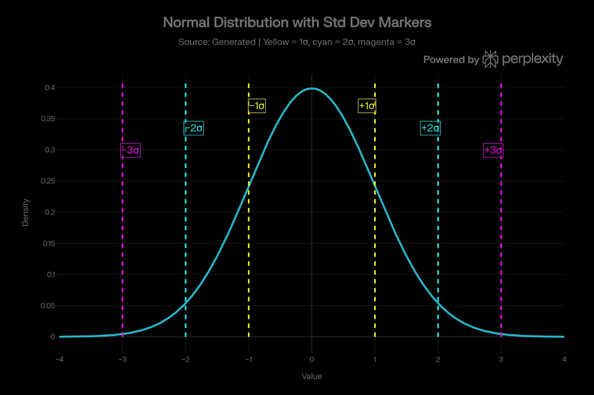

# pandas-workout

## mean and standard deviation

Mean and standard deviation are two of the most important summary statistics for a dataset. The **mean** gives the average or center of the data, while the **standard deviation** shows how spread out the values are around that center.

## Mean

The mean is calculated by adding all values and dividing by the number of values. In pandas, `s.mean()` is essentially the same as `s.sum() / s.count()`, where `s.count()` ignores missing values.

It is useful because it gives one number that represents the whole group, such as average height, age, weight, or income. But it can be misleading if there are extreme values, because a single large outlier can pull the mean away from where most values really are.
An old statistical joke is that when Bill Gates enters a bar, everyone in the bar is now, on average, a millionaire.

## Median

A common alternative is the median, which is the middle value when the data is sorted. If there is an even number of values, the median is the average of the two middle values.

The median is often more robust than the mean because it is less affected by outliers. In the Bill Gates example, the mean income would jump a lot, but the median income would change very little.

## Standard deviation

The standard deviation measures how far values typically are from the mean. A small standard deviation means the data points are clustered closely around the average, while a large one means they are more spread out.

## Why they matter

Together, the mean and standard deviation help describe both the center and the variability of a dataset. That makes them useful for comparing groups, spotting unusual values, and understanding the overall shape of the data.

## Normal Distribution

In a normal distribution, about 68% of the values lie within one standard deviation of the mean, about 95% lie within two standard deviations, and about 99.7% lie within three standard deviations.

### Suitable image idea

A good image would be a bell curve with the mean in the center and shaded regions showing:

- 68% between 68% between `\mu - \sigma` and `\mu + \sigma`
- 95% between `\mu - \sigma` and `\mu + \sigma`
- 99.7% between `\mu - \sigma` and `\mu + \sigma`
